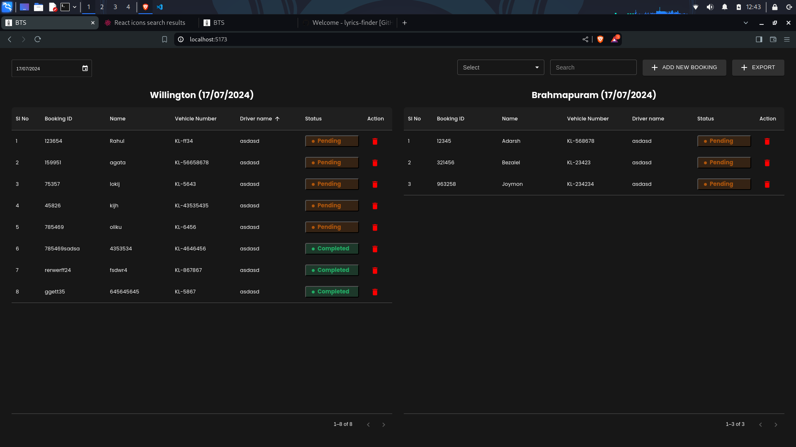
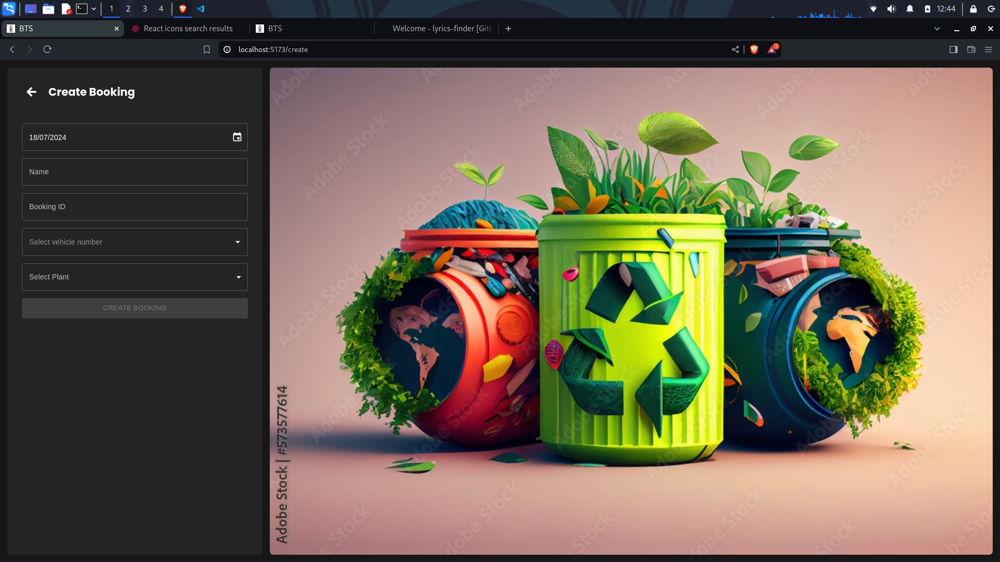

# BOOKING TRACKING SYSTEM (BTS) Frontend

## Features

-   View the list of booking in a particular date
-   Filter the list based on various selectors
-   Delete booking
-   Change booking status
-   Create booking
-   Booking id should be unique
-   Each vehicle can have only one booking per day unless created forcefully

## Built with

-   Semantic HTML5 markup
-   CSS custom properties
-   Flexbox
-   CSS Grid
-   Desktop-first workflow
-   [Vite](https://vitejs.dev/)
-   [Typescript](https://www.typescriptlang.org/)
-   [React](https://reactjs.org/) - JS library

## Design

